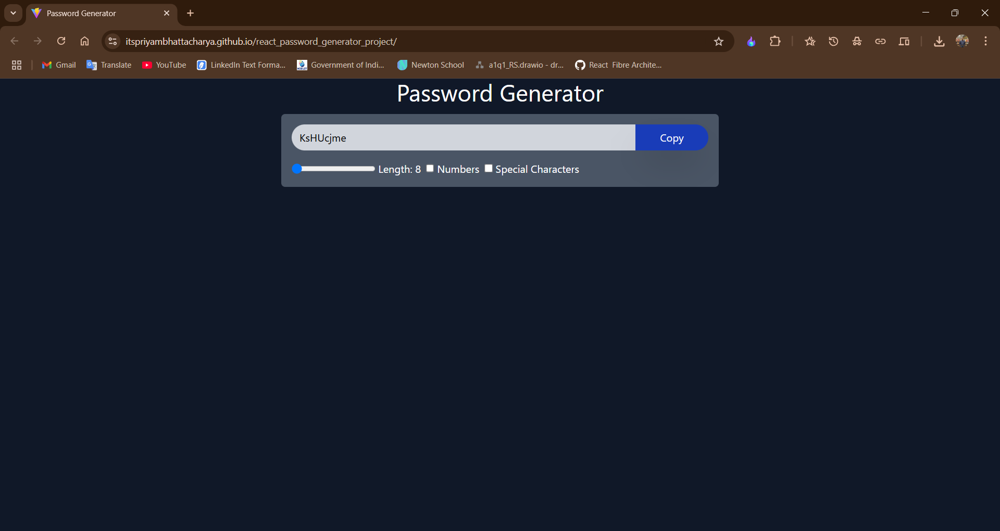

## 📌 Overview

This project is a **dynamic and customizable password generator** built using React. It allows users to generate secure passwords based on various criteria, such as length, inclusion of numbers, and special characters. The application features a clean and responsive UI, ensuring seamless usage across devices.

---

## 🎯 Features

- **Dynamic Password Generation:**  
  Generate random passwords of customizable length (8–50 characters).

- **Customizable Options:**

  - Include/exclude numbers.
  - Include/exclude special characters.

- **Real-Time Updates:**  
  The password is regenerated in real-time based on user preferences.

- **Copy to Clipboard:**  
  Users can easily copy the generated password with a single click.

- **Responsive Design:**  
  Adapts to different screen sizes for a consistent user experience.

---

## 🚀 Technologies Used

- **React** (Hooks: `useState`, `useCallback`, `useEffect`, `useRef`)
- **Tailwind CSS** (for modern styling and layout)
- **JavaScript (ES6)**

---

## 🛠️ Setup Instructions

Follow these steps to set up and run the project locally:

1. **Clone the Repository**

   ```bash
   git clone https://github.com/itspriyambhattacharya/password-generator-react.git
   cd password-generator-react
   ```

2. **Install Dependencies**

   Make sure you have Node.js installed (preferably LTS). Then install the dependencies:

   ```bash
   npm install
   ```

3. **Run the Application**

   ```bash
   npm run dev
   ```

4. **View in Browser**

   Navigate to:

   ```
   http://localhost:5173
   ```

---

## 💻 Usage

- **Adjust Password Length:**  
  Use the range slider to set the desired password length.

- **Include Numbers and/or Special Characters:**  
  Toggle the checkboxes to include numbers (`0-9`) or special characters (`@#!$%^&*`).

- **Copy Password:**  
  Click the **Copy** button to copy the generated password to your clipboard.

---

## 🔍 Code Explanation

The core logic resides in the `App` component:

- **State Variables:**

  - `length`: Password length.
  - `numberAllowed`: Whether to include numbers.
  - `characterAllowed`: Whether to include special characters.
  - `password`: The generated password.
  - `passwordRef`: Reference to the input field for clipboard copy.

- **passwordGenerator():**  
  Generates a random password using uppercase, lowercase, numbers, and special characters based on user choices.

- **copyToClipboard():**  
  Copies the generated password to the clipboard using `window.navigator.clipboard`.

- **useEffect():**  
  Triggers password regeneration when any dependency changes.

---

## 📷 Screenshot



---

## 📝 License

This project is licensed under the [MIT License](LICENSE).

---

## 🤝 Contributing

Contributions are welcome! Please open an issue or submit a pull request for any improvements or suggestions.

---

## 📧 Contact

For questions or feedback, please reach out to:

- **Name:** Priyam Bhattacharya
- **Email:** itspriyambhattacharya@gmail.com
- **LinkedIn:** [Priyam Bhattacharya](https://www.linkedin.com/in/itspriyabhattacharya)

---

Thank you for using this Password Generator!
